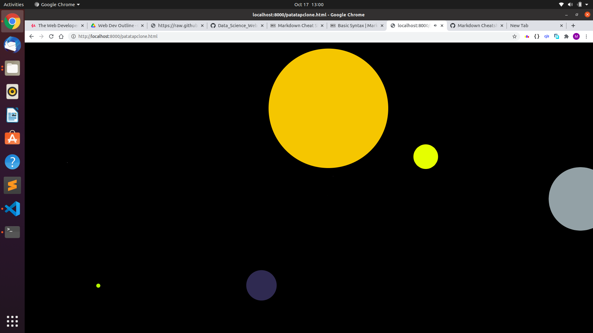

# Patatap-Clone

This is a simple clone of the popular front-end website name <a href="https://patatap.com/">"PataTap"</a>.

**How To Use?** :-

- After cloning the repo, you can run it in terminal as HTTP Server, to avoid CORS Error.

- Then you can randomly as per your choice press alphabetic     keys from 'a' to 'z', and enjoy the sounds and animation.

**I have used the following libraries of JavScript** :-

    1. Howler JS :  For sound-effects and play/pause functionalities.

    2. Paper JS : For animation and circular effects.

> I have used CDN of HowlerJS whereas the
> paper-full.js file for Paper JS.
> Latest version of both the Libraries have been used.

**Errors Resolved** :-

- CORS Errors has been fixed.
     The solution to the same is very simple, if the following steps are followed.

For Windows :-           
 >Since, the CLI of Windows is a bit complicated, hence [this](https://docs.google.com/document/d/1tq4F-E-dGB22O4qs7YsvpcdxXmwj9SJ0-GZVccyeaSU/edit) document can be used for reference/tutorial.

 For Linux/Other CLIs:-
 > Ensure that you have a the latest version of python installed, `python3.x`. 
 > You can first run the terminal, and then give the command `python -m http.server`.
 >  After this open [this](http://localhost:8000/) link in your browser.
 > Then click the `patatapclone.html` file and the app will run.

 - The `urls` syntax has been updated to `src` after using the new version of Howler JS.

 **An active view of the project**
 .

*Any type of suggestions/improvements to this repo are always welcome.*
